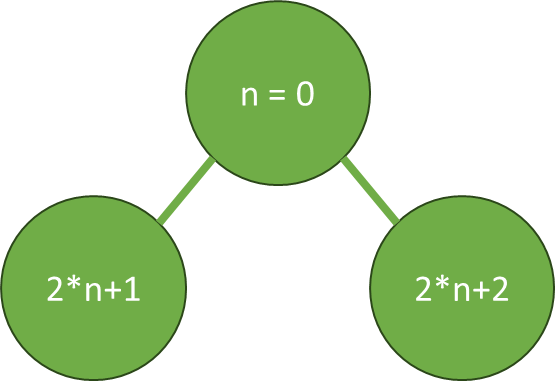

# Aufgabenblock III

## Aufgabe 1 
Berichten Sie aus Ihrer bisherigen Programmierpraxis (sei es im Studium oder im Betrieb): Mit welchen Sprachen haben Sie bisher gearbeitet und welche Aufgaben-/Aufgabentypen haben Sie bearbeitet?

### Programmiersprachen

- C/C++
- Java
- JavaScript
- Python
- Racket
- SQL
- Xtend

### Aufgabentypen
- Algorithmus-Entwicklung
- Automatisierung und Skripting
- Benutzeroberflächen
- Datenbankprogrammierung
- Mobile App-Entwicklung
- Qualitätssicherung/Testing 
- Spieleentwicklung/-erweiterung

## Aufgabe 2
Welche Programmierprojekte haben Sie in letzter Zeit umgesetzt? Erläutern Sie mindestens zwei bis drei.

### Anmerkung
Aus Vertraulichkeitsgründen werden hier keine Projekte der vergangenen Praxisphasen im Betrieb erläutert, sondern lediglich Projekte des Studiums und der privaten Implementierung.

Da es den rahmen überschreiten würde, die Architekturen der Projekte komplett zu berschreiben werden sie hier nur oberflächlich und vereinfacht beleuchtet.

### Minecraft Mod
Minecraft-Mods sind Erweiterungen, die von der Minecraft-Community in Java oder Kotlin erstellt wurden, um das ursprüngliche Spiel zu verändern oder neue Gegenstände und Funktionen hinzuzufügen. 

Minecraft selbst ist ein beliebtes Sandbox-Spiel, bei dem Spieler in einer offenen Welt aus Blöcken bauen und erkunden können. 
Mods ermöglichen es, diese Erfahrung zu personalisieren und auf die verschiedensten arten zu erweitern.

Seit einem Jahr arbeite ich iterativ-inkrementell an solch einer Erweiterung für das Spiel. Die Mod [Dragon Magic And Relics](https://github.com/Joh0210/DragonMagicAndRelics) fügt dem Spiel eine große Menge an neuen Gegenständen, Rituale und Zauber hinzu.
<br>Zusätzlich fügt sie eine komplett neue Spielmechanik hinzu, welche der Kern dieser Erweiterung ist. Sie ermöglicht es dem Spieler Magie auf eine neue, personalisierte weise zu nutzen.

### Android Algorithmen-Lern App: Heap Sort
Für das Modul "Mobile Technologien", des 4. Semesters der Softwaretechnologie mit Prof. Dr. Schultes musste eine bereits existierende Lern-App erweitert werden.

Die App dient als Lernmaterial für das Modul "Algorithmen und Datenstrukturen", in welchem der Begriff des Algorithmus vertieft und theoretisch untersucht wird. 
Hierfür kommen einige Beispielalgorithmen zum einsatz, welche ebenfalls verstanden werden müssen. Um den Studierenden das Verständnis zu erleichtern und beim Lernen zu helfen, 
kommt eine Lern-App zum einsatz, welche einige dieser Algorithmen schrittweise erklärt. 

Grundlegend besteht die App aus 2 Ansichten, eine für den Spielmacher und eine für den Spieler. In beiden Ansichten gibt es anschließend ein Menüfeld,
in welchen man einen Algorithmus aussuchen kann. Aus Spieleransicht wird einem der entsprechende Algorithmus schrittweise erklärt und man bekommt eine Handvoll Informationen über den Algorithmus, wie z.B. über die Komplexität.
Zusätzlich kann der Spieler den Algorithmus manuell durchführen um zu prüfen, ob er ihn richtig verstanden hat. 

Ein Spielmacher kann auch einen Wettbewerb öffnen, an welchem andere Spieler Teilnehmen können um gegeneinander zu Spielen. Hierfür müssen die Spieler jedoch angemeldet sein und Internetzugriff haben. 

Die Grundstruktur der Mobilen Android-Anwendung wurde von Prof. Dr. Schultes erstellt und iterativ-inkrementell in dem Modul "Mobile Technologien" erweitert.
<br>Die Studierenden sollen als Gruppe von bis zu fünf Personen je einen Menüpunkt hinzufügen, welcher die beschriebenen Funktionalitäten erfüllt. 
Für die Server-Kommunikation des Wettbewerbsmodus und das "Hauptmenü" stand eine Grundstruktur zur verfügung, der rest musste von den Studierenden in Java entwickelt werden. 

Als Gruppe bestehend aus Tobias Kapitza, Josias Klaus und mir entschieden wir uns für den Heap Sort Algorithmus welcher dem Nutzer näher gebracht wird.
Wir implementierten auch einige Zusatzziele, wie UI-Tests, ein Troühäen System für den Wettbewerbsmodus und einer persistenten Speicherung der Übungsresultate um den Lernerfolg zu Protokoliren.

## Aufgabe 3
Erläutern Sie an Ihren Beispielen, welche Architektur und welches Paradigma hierbei zur Anwendung kamen.

### Minecraft Mod
Um eine Minecraft Mod zu schreiben, muss an eine der beiden Schnittstellen [Forge](https://files.minecraftforge.net/net/minecraftforge/forge/) oder [Fabric](https://fabricmc.net) anknüpfen, um das Grundspiel zu erweitern.
In beiden Fällen kann in Java oder auch Kotlin programmiert werden, deren objektorientiertes Paradigma in großen Maße genutzt wird. 
Für meine Projekte entschied ich mich für Java, da es auch in die hauptsächlich genutzte Sprache in den Vorlesungen war. 

Die grundlegende Architektur ist bei beiden Schnittstellen gleich, muss jedoch penibel eingehalten werden.  
Es handelt sich hierbei um ein Gradle welches die eigentliche Logik der Mod und dessen Ressourcen strikt trennen.
Die Logik wird zwar durch die Mod definiert, jedoch können Spieler einzelne Ressourcen nach belieben anpassen, um so z.B. Texturen oder Rezepte anzupassen.

- gradle/wrapper/ 
- src/main -> Der komplette Inhalt der Mod 
  - java/ -> In diesem Verzeichnisse ist der Programmcode welcher die Logik definiert
  - resources/ 
    - assets/ -> Texturen, Übersetzungen, etc. die je Client individuell sind
    - data/ -> Rezepte und andere Regeldefinitionen, welche von dem Server festgelegt werden und bei jedem Client gleich sind
    - META-INF/ -> Informationen über die Mod welche von der Schnittstelle benötigt werden
- build.gradle 
- gradle.properties 
- gradlew 
- gradlew.bat 

Die grundlegende Logik lässt sich stark vereinfacht in 3 Punkte unterteilen:
- Neue Objekte Registrieren
- Auf Ereignisse Reagieren
- Komplett neue Spielmechaniken hinzufügen

#### Neue Objekte Registrieren
In Minecraft gibt es Items, Blöcke, Zaubertränke, Kreaturen und engines mehr, welche auch durch Mods hinzugefügt werden können.
Möchte man das tun, muss man eine neue Instanz ein von der entsprechenden (davon erbenden) Klasse erstellen, mit einer ID versehen und registrieren. 

```java
public class ItemInit {
    public static final DeferredRegister<Item> ITEMS = DeferredRegister.create(ForgeRegistries.ITEMS, DragonMagicAndRelics.MOD_ID);

    public static final RegistryObject<Item> DRAGON_CORE = ITEMS.register("dragon_core", () -> 
            new Item(new Item.Properties().fireResistant().rarity(Rarity.EPIC).tab(CreativeModeTab.CreativeModeTab)));
    public static final RegistryObject<Item> MANA_CAKE = ITEMS.register("mana_cake", ManaCakeItem::new);

    public static void register(IEventBus eventBus){
        ITEMS.register(eventBus);
    }
}
```

Soll das Objekt zusätzliche Funktionalitäten beinhalten, lassen sich viele davon umsetzen in dem die ursprüngliche Klasse erweitert wird und einige Klassen-Methoden überschrieben werden und eine Instanz dieser Klasse registriert wird:

```java
public class ManaCakeItem extends Item {
    private static final int NUTRITION = 4;
    
    private static final float SATURATION = 0.4f;

    public ManaCakeItem() {
        super(new Item.Properties().tab(CreativeModeTab.CreativeModeTab).stacksTo(1).rarity(Rarity.COMMON)
                .food((new FoodProperties.Builder()).nutrition(NUTRITION).saturationMod(SATURATION).alwaysEat().build()));
    }

  @Override
  public @NotNull ItemStack finishUsingItem(@NotNull ItemStack itemstack, @NotNull Level world, @NotNull LivingEntity entity) {
    super.finishUsingItem(itemstack, world, entity);
    return new ItemStack(ItemInit.MANA_CAKE.get());
  }
}
```

#### Auf Ereignisse Reagieren
Einige Funktionalitäten von neuen Objekten lassen sich nicht allein durch Überschreiben von Klassenmethoden realisieren. Ist das der Fall, muss in der Regel ein Event Handler erstellt werden.

Minecraft ist Event-Driven aufgebaut, also bei jedem Ereignis das in der Welt passiert, wird ein entsprechendes Event generiert. Z.B. Springt ein Spieler, wird ein Objekt der Klasse `LivingJumpEvent` geworfen.
Diese Events sind nach dem Observer-pattern, damit sich sogenannte Event Handler von Mods als Listener Registrieren können und auf das Event reagieren können. 

Hat sich z.B. ein Event Handler für das `LivingJumpEvent` registriert und ein Spieler springt, wird die entsprechende Funktion des Event Handler aufgerufen. 
Die instanz des `LivingJumpEvent` beinhaltet dabei alle Informationen, die für die Verarbeitung notwendig sind. Durch Manipulation der einzelnen Attribute der Instanz lässt sich dann mit der Welt interagieren. 

```java
@Mod.EventBusSubscriber(modid = DragonMagicAndRelics.MOD_ID, bus = Mod.EventBusSubscriber.Bus.FORGE)
public class CommonEventHandler {
    @SubscribeEvent
    public static void onLivingJump(LivingEvent.LivingJumpEvent event) {
        if(event.getEntity() instanceof Player player && !player.getLevel().isClientSide()){
            if (player.isSprinting()) {
                player.push(player.getDeltaMovement().x * 0.2f, 0.6f, player.getDeltaMovement().z * 0.2f);
                player.hurtMarked = true;
            }
        }
    }
}
```

Auch eigene Events, auf die andere Modmacher reagieren können, lassen sich erstellen, aber das ist etwas zu weitgreifend für das Portfolio.

#### Komplett neue Spielmechaniken hinzufügen
Die beiden oberen Erweiterungsmöglichkeiten sind klar definiert wie sie umzusetzen sind. 
Möchte man jedoch eine komplett neue Spielmechanik hinzufügen oder Hilfsklassen erstellen, ist der Entwickler sehr frei in der Umsetzung.

In den meisten Fällen gibt es hierfür eine Klasse, welche die eigentliche Spielmechaniken-Logik beinhaltet. 
Diese wird kann nach belieben implementiert werden und wird standardmäßig über ein selbst definiertes Interface angesteuert. 
In einem zweiten Schritt wird das Interface mit den benötigten Events durch ein Event Handler verknüpft.

Dieser Abschnitt ist bei weitem der Komplizierteste, bietet jedoch auch den meisten Freiraum in der Umsetzung.

### Android Algorithmen-Lern App: Heap Sort
Für die Android nativ Entwicklung können standardmäßig ebenfalls die beiden objektorientierten Sprachen Java und Kotlin verwendet werden.

Auch hier werden die Ressourcen (z.B. Übersetzungen, Layouts, Bilder, ...) streng von der Logik getrennt, so das sich leicht, und auch ohne Code Kenntnisse anpassungen, wie z.B. Übersetzungen, vornehmen lassen.

Damit es wenig ungewollte interferenzen zwischen den Teams gab, wurde innerhalb des Haupt-Packages ("Root Verzeichnis" für den Java Code), 
für jedes Team ein sub Package erstellt, in welchem sie ihre Logik Implementieren sollten. Die erstellten Ressourcen wurden mit einem Prefix entsprechend der Team-ID versehen.
Auf diese Weise kommt es zu möglichst wenig problemen, wenn mehrere Teams an demselben Programm arbeiten.

Eine typische Strategie, welche ebenfalls von uns umgesetzt wurde, ist die Frontend- und Backendlogik voneinander zu trennen.

#### Frontendlogik
Das was der Nutzer einer Android-Nativ-App sieht, sind sogenannte `Activities`. Das sind Instanzen einer entsprechenden Activity-Klasse.
Die Elemente und das Layout der Activity, also z.B. ein Knopf, mit besonderer Farbe, Text im Inneren und wo auf dem Bildschirm er sich befindet, wird durch eine verknüpfte Ressource definiert.
Was die einzelnen Elemente jedoch machen, z.B. was passiert wenn man einen Knopf drückt, oder wie mit dem Livecycle der Activity wird durch die entsprechende Klasse definiert, 
in dem Parent-Methoden überschrieben Objekte maipuliert werden. 

```java
public class MainActivity extends AppCompatActivity {

  private ActivityMainBinding binding;

  @Override
  protected void onCreate(Bundle savedInstanceState) {
    super.onCreate(savedInstanceState);

    binding = ActivityMainBinding.inflate(getLayoutInflater());
    setContentView(binding.getRoot());

    AppBarConfiguration appBarConfiguration = new AppBarConfiguration.Builder(
            R.id.navigation_home, R.id.navigation_dashboard, R.id.navigation_notifications)
            .build();
    NavController navController = Navigation.findNavController(this, R.id.nav_host_fragment_activity_main);
    NavigationUI.setupActionBarWithNavController(this, navController, appBarConfiguration);
    NavigationUI.setupWithNavController(binding.navView, navController);
  }
}
```

Neben Activities können auch Fragments verwendet werden. Instanzen dieser Klasse werden dem Nutzer ebenfalls angezeigt, 
jedoch nehmen sie nicht den ganzen Bildschirm ein, sondern sind oftmals teil einer Activity.

In beiden Fällen muss die Objektorientierung für die Logik des Frontend genutzt werden.

#### Backendlogik
Die Backendlogik ist auch in Java oder Kotlin verfasst, jedoch ist der Entwickler hier sehr frei in der Umsetzung. 
Er muss keine speziellen Design Patterns einhalten, kann sie jedoch nach belieben Implementieren oder andere herangehensweisen nutzen.

## Aufgabe 4
Ließen sich die Projekte oder Aufgaben auch mit dem Paradigma der funktionalen Programmierung umsetzen? Begründen Sie Ihre Antwort.

### Antwort
Nein, nicht komplett. In beiden Fällen handelt es bei den Projekten um eine Erweiterung eines Bereits existierenden Systems. 
Auf diese Weise wird zum einen die Programmiersprache als Java (oder Kotlin) vorgegeben, welche auf das Paradigma der Objektorientierung ausgelegt ist, 
jedoch ließe sich auch damit das Functional Paradigma umsetzen.

Zum anderen wird jedoch auch die Architektur der Logik-Komponenten vorgegeben. 
So muss, wie in Aufgabe 3 erklärt, ein neues Objekt in Minecraft immer als Instanz einer Klasse registriert werden. 
Auch die Activities von Android sind ebenfalls Instanzen der entsprechenden Klassen. 
<br>Auch der Inhalt dieser Klassen kann nur sehr begrenzt Funktional umgesetzt werden, 
da die Funktionalität hauptsächlich durch Überschreiben von Parent-Methoden und Objektmanipulation stattfindet.

Auch das Reagieren auf Ereignisse in Minecraft nutzt ebenfalls Objekte als Kommunikationsmedium, 
und nur durch dessen Manipulation lässt sich mit der Welt interagieren.

Functionale Programmierung lässt zwar bedingt auch die Nutzung von Objekten zu, jedoch geht es in diesen Fällen hauptsächlich um die bewusste nutzung von Seiteneffekten, 
welche dem Paradigma der funktionalen Programmierung wieder strebt. 

Jedoch lassen sich potenziell einige Teile mithilfe des funktionalen Paradigmas umsetzen. 

So muss zwar an einem gewissen Punkt die Backendlogik einer Androidapp wieder mit der Objektorientierung der Frontendlogik verbunden werden 
oder die Logik der Komplett neue Spielmechaniken in Minecraft mit dem Event-System verbunden werden, jedoch gibt es keine Vorgaben, wie die interne Logik aufgebaut sein muss.
Diese Abschnitte müssten zwar weiterhin in Java (oder Kotlin) implementiert werden, jedoch ist es theoretisch möglich auch andere herangehensweisen zu nutzen.
Hierbei ist allerdings zu beachten, dass Rekursionen, auch Endrekursive-Rekursionen, nicht sonderlich optimiert sind, und im großen Umfang für ein ineffizientes Verhalten sorgen können.

### Alternative Frage:
Ließen sich die Basis-Projekte auch mit dem Paradigma der funktionalen Programmierung umsetzen? Begründen Sie Ihre Antwort.

#### Minecraft
Auch funktionale Programmiersprachen ermöglichen die Entwicklung von Spielen, jedoch ist Minecraft über die Jahre hinweg extrem umfangreich geworden und stark mit dem Paradigma der Objektorientierung verknüpft. 
Sich davon zu trennen wäre wahrscheinlich möglich, bedeutet jedoch das die komplette Architektur die über viele Jahre hinweg gewachsen ist, von Grund auf überarbeitet werden muss. 
Wie das die Prformance beinflussen würde, wird nicht weiter untersucht.

Gleichermaßen ist ein großer Bestandteil für viele der Spieler, die verfügbarkeit von Mods, welche von der Minecraft-Community bereitgestellt werden. 
Dies Fülle an über 10.000 Mods [Quelle](https://www.curseforge.com/minecraft/mc-mods), ist unter anderem deshalb möglich gewesen, 
dass eine weit verbreitete Programmiersprache für die Entwicklung verwendet werden kann. Da funktionale Sprachen deutsch weniger verbreiteter sind [Quelle](https://de.statista.com/statistik/daten/studie/678732/umfrage/beliebteste-programmiersprachen-weltweit-laut-pypl-index/)
hätte es wahrscheinlich deutlich weniger Entwickler in der Minecraft-Community gegeben, welche in der Lage gewesen wären, das Spiel um die inhalte zu erweitern.

Zusammenfassend lässt sich vermuten, dass es rein Funktional umsetzbar wäre, jedoch würde dies eine Grundlegend andere Architektur bedeuten und hätte wahrscheinlich eine deutlich kleinere Modding-Community, 
was auch für den Erfolg des Spiels hinderlich gewesen sein könnte

#### Android Algorithmen-Lern App
Android Navie Apps lassen sich auch mit Hilfe von funktionalen Programmiersprachen, wie Haskell, implementer [Quelle 1](https://stackoverflow.com/questions/5151858/running-a-haskell-program-on-the-android-os), [Quelle 2](https://github.com/neurocyte/android-haskell-activity).
Die Objektorientierung fand in kombination mit einigen Design-Patterns einsatz, jedoch in einer deutlich loser als z.B. bei Minecraft. 
Auf diese Weise muss zwar z.B. die bestehenden Activities neu definiert werden, jedoch müsste nicht grundlegend neu definiert werden was Activities sind und wie sie sich verhalten, da die Android-Umgebung nicht überarbeitet werden müsste.

Die Backendlogik wurde von Gruppe zu Gruppe unterschiedlich implementiert, jedoch handelt es sich hierbei hauptsächlich um Algorithmen, die entsprechend auch mit funktionalen Verfahren implementiert werden können.

Also Ja, das Projekt hätte, von Grund auf mit der funktionalen Programmierung umgesetzt werden können.

**Anmerkung**: Der hauptsächlichen Gründe was dagegen sprechen würde ist, dass die Programmiersprache Java den Studierenden bereits im 1. Semester beigebracht wurde und eine funktionale Sprache hätte erst beigebracht werden müssen, wodurch andere Themen des Lehrplans gekürzt werden müssten. 
Zusätzlich lässt sich auch sagen das Java zwar immer weniger für die Appentwicklung verwendet wird, aber immer noch deutlich als funktionale Sprachen, wodurch es sinnvoll sein kann diesen Prozess eher mit Java zu üben.

## 5 Todo!

## Aufgabe 6
Wählen Sie sich abschließend eines der Projekte aus und versuchen eine prototypenhafte Umsetzung, an der man die funktionale Umsetzung erkennen kann.

### Anmerkung:
- Da beide Projekte mehrere Wochen bis Monate Entwicklungszeit benötigten, und sich nicht jeder Teil funktional Umsetzen lässt (vgl. Aufgabe 4), wurde sich dazu entschieden, nur einen Teilausschnitt eines der Projekte zu implementieren, welcher sich als sehr Komplex und umfangreich herausstellt 
- Es ist empfehlenswert sich diesen Code in einer Entwicklungsumgebung anzuschauen, um ihn besser nachvollziehen zu können
- Bei der funktionalen Umsetzung wäre es auch möglich gewesen den Heap über verschachtelte Paare darzustellen, jedoch wurde sich dazu entschieden Listen zu verwenden, um den Originalen Projekt ähnlicher zu sein
- Die Nutzung von Listen, vor allem durch die Nutzung von der `get-at` Funktion ist potenziell etwas weniger Effizient, allerdings wird die Funktion `getSteps()` im Original nur sehr selten aufgerufen, weshalb Optimierungen an oft genzutaten Funktionen empfehlenswerter sind.
- Die erstelle Funktion kann sowohl für Strings als auch Zahlen verwendet werden, solange keine Mischung stattfindet
- Für den Heap in Array Darstellung gilt, das 0. Element des ist das Root-Node. Die Positionen der Child-Nodes im Arrays sind `2*n+1` und `2*n+2` für `n = Poistion des Parrent`. Daraus folgt u.a. dass die Position aller Linken Child-Nodes immer Ungerade sind.



###  Android Algorithmen-Lern App: Heap Sort
Die Kernkomponente unserer Algorithmen erklärung des Heap Sort verlangte, dass wir eine Liste mit jedem Schritt der Sortierung erhalten.

```java
public class Main {
  public static void main(String[] args) {
    HeapSortAlgorithmJava<Integer> heapSort = new HeapSortAlgorithmJava<>(new Integer[]{1, 2, 3, 4, 5}, true);
    for (ArrayList<Integer> step : heapSort.getSteps()) {
      System.out.println(step);
    }
  }
}
```

```java
/**
 * detailed step calculation of HeapSort
 * @param <T> type of comparable entry to sort
 * @author Johannes Freund, Tobias Kapitza
 */
public class HeapSortAlgorithmJava<T extends Comparable<T>> {
  public final T[] orgArray;
  private final ArrayList<ArrayList<T>> steps;
  private int counter = -1;

  public HeapSortAlgorithmJava(T[] orgArray, boolean isMinHeap) {
    this.orgArray = orgArray;
    this.steps = heapSort(orgArray, isMinHeap);
  }

  /**
   * @return array of every step
   */
  public ArrayList<ArrayList<T>> getSteps() {
    return steps;
  }

  /**
   * iteration increases by one
   * @return get the next step in order or null if current step is last
   */
  public ArrayList<T> getNext(){
    return getNext(true);
  }

  /**
   * @param increment Should the next higher step be output when called again?
   * @return Next step or null if the current step is the last.
   */
  public ArrayList<T> getNext(boolean increment){
    if(steps.size() <= counter +1){
      return null;
    }

    if(increment){
      counter++;
      return steps.get(counter);
    }
    return steps.get(counter + 1);
  }

  /**
   * @return true if size of array changes in the next step (insert or delete)
   */
  public boolean isBigStepNext(){
    return counter == -1 || steps.size() <= counter + 1 || (steps.get(counter).size() != getNext(false).size());
  }

  private ArrayList<ArrayList<T>> heapSort(T[] orgArray, boolean isMinHeap){
    ArrayList<ArrayList<T>> ret = new ArrayList<>();
    ArrayList<T> currentVersion = new ArrayList<>();

    for(T element : orgArray){
      currentVersion.add(element);
      ret.add(new ArrayList<>(currentVersion));
      ret.addAll(heapifyInsert(currentVersion, isMinHeap));
    }

    for(int i = 0; i < orgArray.length; i++){
      currentVersion.set(0, currentVersion.get(currentVersion.size()-1));
      currentVersion.remove(currentVersion.size()-1);
      ret.add(new ArrayList<>(currentVersion));
      ret.addAll(heapifyDeleteFirst(currentVersion, isMinHeap));
    }
    return ret;
  }

  private ArrayList<ArrayList<T>> heapifyInsert(ArrayList<T> step, boolean isMinHeap) {
    ArrayList<ArrayList<T>> ret = new ArrayList<>();

    int posElement = step.size() - 1;
    //If the elements are the same, they are unnecessarily exchanged once
    while(getParentPos(posElement) >= 0 && (step.get(getParentPos(posElement)).compareTo(step.get(posElement)) > 0 == isMinHeap)){
      T temp = step.get(getParentPos(posElement));
      step.set(getParentPos(posElement), step.get(posElement));
      step.set(posElement, temp);
      posElement = getParentPos(posElement);
      ret.add(new ArrayList<>(step));
    }
    return ret;
  }

  private ArrayList<ArrayList<T>> heapifyDeleteFirst(ArrayList<T> step, boolean isMinHeap) {
    ArrayList<ArrayList<T>> ret = new ArrayList<>();

    int posElement = 0;
    while(hasSmallerChild(posElement, step, isMinHeap)){
      int smallerChildPos = getChildPos(posElement, isLeftSmaller(posElement, step, isMinHeap));
      T temp = step.get(smallerChildPos);

      step.set(smallerChildPos, step.get(posElement));
      step.set(posElement, temp);
      posElement = smallerChildPos;
      ret.add(new ArrayList<>(step));
    }
    return ret;
  }

  private int getParentPos(int childPos) {
    if (childPos != 0){
      return (int) Math.floor((childPos - 1) / 2.0);
    } else {
      return -1;
    }
  }

  private int getChildPos(int parentPos, boolean left) {
    return 2 * parentPos + (left ? 1 : 2);
  }

  /**
   * @param parentPos Position of the parent node to be examined
   * @param step Current structure of the heap
   * @param isMinHeap Is it a MinHeap? If Max Heap it is checked whether the child is LARGER!
   * @return true if the parent has at least one child smaller than then it.
   */
  private boolean hasSmallerChild(int parentPos, ArrayList<T> step, boolean isMinHeap){
    for(boolean left : new boolean[]{true, false}){
      if(getChildPos(parentPos, left) <= step.size() - 1 && (step.get(parentPos).compareTo(step.get(getChildPos(parentPos, left))) > 0) == isMinHeap){
        return true;
      }
    }
    return false;
  }

  /**
   * The node must have at least one child!
   * @param parentPos Position of the parent node to be examined
   * @param step Current structure of the heap
   * @param isMinHeap Is it a MinHeap? If Max Heap it is checked whether the child is LARGER!
   * @return true if the left child is smaller than the right one or if the right does not exist
   */
  private boolean isLeftSmaller(int parentPos, ArrayList<T> step, boolean isMinHeap){
    if(getChildPos(parentPos, false) > step.size() - 1){
      return true;
    }
    return (step.get(getChildPos(parentPos, true)).compareTo(step.get(getChildPos(parentPos, false))) < 0) == isMinHeap;
  }
}
```

Die Funktion `getSteps()` muss also funktional in Racket umgesetzt werden:

```
#lang racket

(define (get-steps lst is-min-heap)
  ; Gibt das x. Element einer Liste zurück
  (define (get-at lst pos)
    (cond
      ((empty? lst) (error "IndexOutOfBoundsException"))
      ((<= pos 0) (first lst))
      (else (get-at (rest lst) (- pos 1)))))

  ; Ermittelt die Position einer Parent-Node einer Node in einem binären Heap
  ; -1 falls die Node die Root Node ist 
  (define (get-parent-pos child-pos)
    (cond
      (( <= child-pos 0) -1)
      (else (floor (/ (- child-pos 1) 2.0)))))

  ; Ermittelt ob die Heap-Condition des Binären Heaps gebrochen ist
  ; #f falls die Heap-Condtion nicht gebrochen ist
  ; Position der Child-Node an der die Heap-Condtion nicht erfüllt ist
  ; Support für Strings und Numbers
  ; Sollte es 2 Kandidaten geben, die mit dem Parent getauscht werden können,
  ; wird der kleinere (minheap)/größere (maxheap)genommen.
  (define (heapify-broken? lst)
    (define (broken-at? lst pos)
      (cond
        ((empty? lst) #f)
        ((<= pos 0) #f)
        ((equal? is-min-heap
                 ((cond ((number? (first lst)) >=) ((string? (first lst)) string>=?)(else (error "TypeException")))
                  (get-at lst pos) (get-at lst (get-parent-pos pos))))
         (broken-at? lst (- pos 1)))
        ; Fehlerfall:
        ((and (odd? pos) (= pos (- (length lst) 1))) pos)
        ; wähle das kleinere (minheap) der beiden Kinder (größere für dem Maxheap) 
        ((equal? is-min-heap
                 ((cond ((number? (first lst)) <=) ((string? (first lst)) string<=?)(else (error "TypeException")))
                  (get-at lst pos) (get-at lst ((cond ((odd? pos) +) (else -)) pos 1)))) pos)
        ; die Position aller Linken Child-Nodes sind immer Ungerade
        (else ((cond ((odd? pos) +) (else -)) pos 1))))
    (broken-at? lst (- (length lst) 1)))

  ; Tauscht 2 Elemente einer Liste
  (define (swap pos1 pos2 lst)
    (define (swap-inner1 pre value1 pos2 lst)
      (cond
        ((and (<= pos2 0) (empty? lst)) (append pre (list value1)))
        ((<= pos2 0) (append pre (list value1) (rest lst)))
        (else (swap-inner1 (append pre (list (first lst))) value1 (- pos2 1) (rest lst)))
        ))

    (define (swap-inner2 pre pos1 pos2 lst)
      (cond
        ((<= pos1 0) (swap-inner1 (append pre (list (get-at lst pos2))) (first lst) (- pos2 1) (rest lst)))
        (else (swap-inner2 (append pre (list (first lst))) (- pos1 1) (- pos2 1) (rest lst)))))

    (cond
      ((< pos1 0)(error "IndexOutOfBoundsException"))
      ((< pos2 0)(error "IndexOutOfBoundsException"))
      ((< pos1 pos2)(swap-inner2 null pos1 pos2 lst))
      ((> pos1 pos2)(swap-inner2 null pos2 pos1 lst))
      (else lst)))

  ; Wenn die Heap-Condition der liste gebrochen wurde,
  ; fürt diese Funktion genau einen Schritt aus um sie stückweise wieder her zu stellen.
  (define (heapify-step lst)
    (swap (get-parent-pos (heapify-broken? lst)) (heapify-broken? lst) lst))

  ; Baut den Heap Schrittweise auf
  (define (insert-step current ret lst)
    (cond
      ((heapify-broken? current) (insert-step (heapify-step current) (append ret (list current)) lst))
      ((empty? lst) (append ret (list current)))
      (else (insert-step (append current (list (first lst))) (cond ((empty? current) ret)(else (append ret (list current)))) (rest lst)))))

  ; Baut den Heap Schrittweise ab.
  ; Nutzt als ausgabgspunkt den letzen Schritt der insert-steps
  (define (delete-step insert-steps)
    (define (delete-step-inner current ret)
      (cond
        ((heapify-broken? current) (delete-step-inner (heapify-step current) (append ret (list current))))
        ((<= (length current) 1) (append ret (list current)))
        (else (delete-step-inner (cons (last current) (reverse (rest (reverse (rest current))))) (append ret (list current))))))

    (delete-step-inner (cons (last (last insert-steps)) (reverse (rest (reverse (rest (last insert-steps)))))) insert-steps))

  ; Interner Aufruf der Funktion
  (cond
    ((empty? lst) null)
    ((<= (length lst) 1) (list lst))
    (else (delete-step (insert-step null null lst))))
  )
```